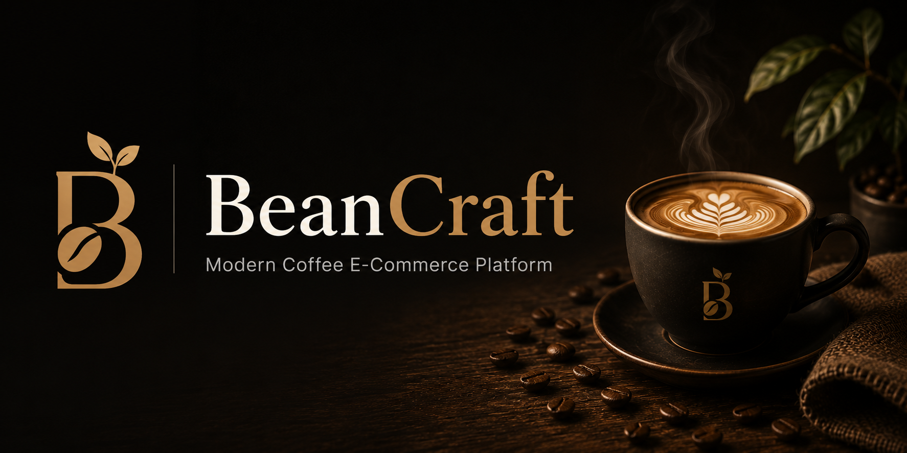
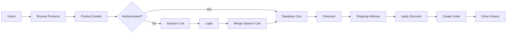
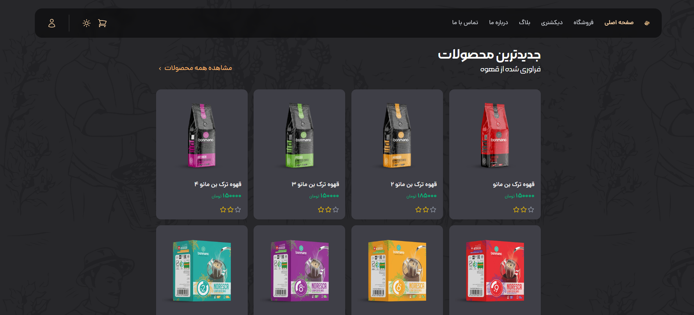
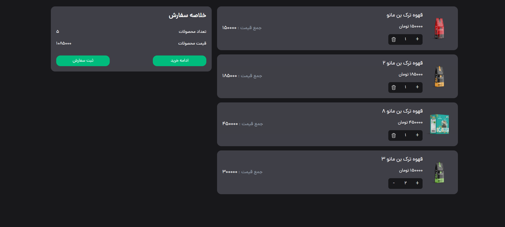
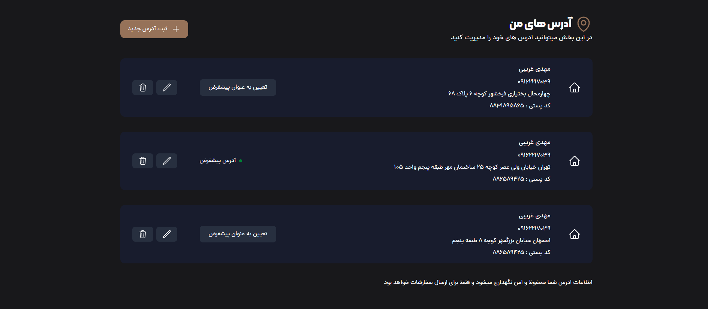

<div align="center">



<br>

☕ BeanCraft
Modern Coffee E-Commerce Platform

<p> A production-inspired e-commerce platform built with <strong>Django</strong>, focused on clean architecture, seamless shopping workflows, and a modern user experience. </p>

<p>

<a href="#-getting-started">Getting Started</a> •
<a href="#-features">Features</a> •
<a href="#-project-architecture">Architecture</a> •
<a href="#-roadmap">Roadmap</a>

</p>

<br>


</div>
---

## 📖 Overview

BeanCraft is a production-inspired coffee e-commerce platform developed with **Django**, designed to simulate the architecture and workflows of a modern online store.

Rather than focusing solely on CRUD operations, the project addresses real-world challenges commonly found in e-commerce applications, including persistent shopping carts, seamless cart synchronization after user authentication, discount management, order processing, and responsive user interactions.

The application follows a modular architecture where each component is responsible for a specific business domain, making the codebase easier to maintain, extend, and scale. Features such as AJAX-powered interactions, session-based shopping carts, and automatic cart merging provide a smoother shopping experience while reflecting production-oriented development practices.

### 🎯 Project Goals

* Build a realistic e-commerce application using Django.
* Apply clean architecture and modular design principles.
* Improve user experience through asynchronous interactions.
* Demonstrate practical backend development skills.
* Create a portfolio project inspired by production-ready applications.

### 💡 What Makes This Project Different?

Unlike many educational e-commerce projects that only demonstrate basic CRUD functionality, BeanCraft focuses on solving real user scenarios.

Some of its notable implementations include:

* Automatic synchronization between session and database shopping carts after login.
* Shopping cart persistence for both anonymous and authenticated users.
* Discount code validation and order management.
* Responsive user interface enhanced with AJAX interactions.
* Clean and maintainable Django application structure designed for future scalability.


---

# ✨ Highlights

* ⚡ AJAX-powered shopping experience
* 🛒 Session-based & Database Shopping Cart
* 🔄 Automatic Cart Merge after Login
* ❤️ Favorite Products
* 🎁 Discount Code System
* 📦 Order Management
* 📱 Fully Responsive UI
* 🏗 Clean Django Architecture


---

# 🚀 Features


BeanCraft is designed around real-world e-commerce workflows rather than simple CRUD operations. Each module has a specific responsibility and is built to provide a scalable and maintainable architecture.

| Module                  | Capabilities                                                                                                                                                    |
| :---------------------- | :-------------------------------------------------------------------------------------------------------------------------------------------------------------- |
| 🔐 **Authentication**   | User registration, secure login/logout, profile management and authenticated user sessions.                                                                     |
| ☕ **Product Catalog**   | Browse products, explore categories, search products and view detailed product information.                                                                     |
| 🛒 **Shopping Cart**    | Session-based cart for guests, database cart for authenticated users, automatic cart merging after login, quantity management and live cart updates using AJAX. |
| ❤️ **Favorites**        | Save products for later, manage a personal wishlist and quickly access favorite items.                                                                          |
| 🎁 **Discount System**  | Apply discount codes, validate coupons and support both percentage-based and fixed amount discounts.                                                            |
| 📦 **Order Management** | Create orders, manage shipping addresses, review order summaries and access order history.                                                                      |
| ⚡ **User Experience**   | Responsive interface, asynchronous interactions with AJAX and optimized shopping workflow.                                                                      |

---

## ⭐ Core Functionalities

### 🛒 Smart Shopping Cart

Unlike traditional shopping carts, BeanCraft keeps the shopping experience uninterrupted.

* Session cart for anonymous visitors.
* Database cart for authenticated users.
* Automatic cart synchronization after login.
* Real-time quantity updates.
* Remove products instantly using AJAX.

---

### 🔄 Automatic Cart Merge

One of the key features of BeanCraft is the seamless migration of the shopping cart after authentication.

```text
Guest User
     │
     ▼
 Session Cart
     │
 Login
     │
     ▼
 Merge Process
     │
     ▼
 Database Cart
```

This ensures that users never lose the products they added before signing in.

---

### 🎁 Flexible Discount Engine

The discount module supports multiple pricing strategies.

* Percentage discounts
* Fixed amount discounts
* Coupon validation
* Automatic discount calculation

---

### ❤️ Wishlist System

Users can create and manage their own list of favorite products, allowing quick access to items they plan to purchase later.

---

### ⚡ AJAX-Powered Interactions

Several user actions are performed asynchronously to improve the overall experience.

* Add products to cart
* Update quantities
* Remove cart items
* Manage favorites
* Apply discount codes

This minimizes unnecessary page reloads and creates a smoother shopping experience.

---

## 🎯 Designed with Scalability in Mind

The project follows a modular architecture where each application has a single responsibility.

* **accounts** → Authentication & User Management
* **shop** → Products & Categories
* **cart** → Shopping Cart Logic
* **order** → Order Processing
* **payment** → Payment Workflow
* **core** → Project Configuration

This separation of concerns improves readability, maintainability and future extensibility.


---

## ☕ Products

* Product Listing
* Categories
* Product Details
* Product Search

---

## 🛒 Shopping Cart

* Session Cart
* Database Cart
* Cart Merge after Login
* Quantity Management
* Remove Products
* Live Cart Updates

---

## ❤️ Favorites

* Add to Favorites
* Remove Favorites
* Personal Favorite List

---

## 🎁 Discount System

* Fixed Discounts
* Percentage Discounts
* Discount Validation

---

## 📦 Orders

* Checkout
* Shipping Address
* Order History
* Order Summary

---

# 🏗 Project Architecture

```text
Visitor
    │
    ▼
Browse Products
    │
    ▼
Session Cart
    │
Login
    │
    ▼
Merge Cart
    │
    ▼
Database Cart
    │
    ▼
Checkout
    │
    ▼
Create Order
```

---


## 🏗 Architecture


BeanCraft follows a modular architecture where each application is responsible for a specific business domain. This separation of concerns keeps the project maintainable, scalable, and easy to extend as new features are introduced.

The following diagram illustrates the high-level workflow of the application.



---

## 🧩 Application Modules

| Module       | Responsibility                                                             |
| ------------ | -------------------------------------------------------------------------- |
| **accounts** | Authentication, user profiles and account management.                      |
| **shop**     | Products, categories, search and product details.                          |
| **cart**     | Session cart, database cart, quantity management and cart synchronization. |
| **order**    | Order creation, shipping address and order history.                        |
| **payment**  | Payment workflow and checkout process.                                     |
| **core**     | Project configuration, shared settings and common utilities.               |

---

## 💡 Architectural Highlights

### 🛒 Dual Shopping Cart Strategy

BeanCraft supports two independent shopping cart implementations:

* **Session Cart** for anonymous visitors.
* **Database Cart** for authenticated users.

This approach allows visitors to start shopping immediately without creating an account while ensuring long-term cart persistence after login.

---

### 🔄 Automatic Cart Synchronization

When a guest user signs in, the session cart is automatically merged into the user's database cart.

This prevents data loss and provides a seamless shopping experience similar to modern commercial e-commerce platforms.

---

### ⚡ Asynchronous User Experience

Several user interactions are handled asynchronously using AJAX, including:

* Adding products to the cart
* Updating quantities
* Managing favorites
* Applying discount codes

Reducing full page reloads improves responsiveness and overall usability.


# 💡 Engineering Decisions

BeanCraft was designed with the goal of simulating real-world e-commerce workflows rather than implementing only basic CRUD functionality.

This section highlights some of the key architectural and engineering decisions made throughout the development process.

---

## 🛒 Dual Shopping Cart Strategy

### Challenge

Visitors should be able to add products to their cart without creating an account. At the same time, authenticated users need a persistent shopping cart that remains available across devices and future sessions.

### Decision

BeanCraft uses two separate shopping cart implementations:

* **Session-based Cart** for anonymous visitors.
* **Database-backed Cart** for authenticated users.

### Why?

This approach reduces friction for first-time visitors while ensuring long-term persistence after authentication, providing a shopping experience similar to modern e-commerce platforms.

---

## 🔄 Automatic Cart Synchronization

### Challenge

Products added by a guest user should not disappear after logging in.

### Decision

When authentication is completed, the session cart is automatically merged into the user's database cart.

### Why?

This preserves the user's shopping journey and eliminates the frustration of rebuilding the cart after signing in.

---

## 🔒 Atomic Order Creation

### Challenge

Creating an order involves multiple database operations. If one operation fails, partial or inconsistent data should never be stored.

### Decision

Critical order creation logic is executed inside a database transaction.

### Why?

Using `transaction.atomic()` guarantees that either the entire order is created successfully or no changes are committed, maintaining database consistency.

---

## ⚡ AJAX-Driven User Experience

### Challenge

Reloading the entire page after every interaction creates an unnecessary interruption in the shopping experience.

### Decision

AJAX is used for common user actions such as:

* Adding products to the cart
* Updating quantities
* Managing favorites
* Applying discount codes

### Why?

Asynchronous requests make the interface faster, smoother, and more responsive.

---

## 🏛 Modular Django Applications

### Challenge

As an application grows, keeping all business logic inside a single Django app becomes difficult to maintain.

### Decision

The project is organized into multiple Django applications, each responsible for a specific business domain.

| Application  | Responsibility                     |
| ------------ | ---------------------------------- |
| **accounts** | Authentication and user management |
| **shop**     | Products, categories and catalog   |
| **cart**     | Shopping cart logic                |
| **order**    | Order processing                   |
| **payment**  | Checkout workflow                  |
| **core**     | Shared configuration               |

### Why?

Separating responsibilities improves readability, testing, scalability and future maintenance.

---

## 📈 Scalability Considerations

Several implementation choices were made with future extensibility in mind.

Current architecture makes it easier to introduce features such as:

* Online payment gateways
* REST APIs
* Background task processing
* Redis caching
* Docker deployment
* CI/CD pipelines

The objective is to keep the project maintainable while allowing new functionality to be integrated with minimal changes to the existing codebase.


[//]: # (Screenshots)


# 📸 Screenshots

A quick visual tour of BeanCraft.

> The following screenshots highlight the main user flows of the application, from browsing products to completing an order.

## 🏠 Home Page

Browse featured products, categories and promotions.

<p align="center">

</p>

---

## ☕ Product Details

View product information, pricing and add products to the shopping cart.

<p align="center">

</p>

---

## 🛒 Shopping Cart

Manage cart items, update quantities and review the order summary.

<p align="center">

</p>

---

## 📍 Shipping Address

Select or create a shipping address before checkout.

<p align="center">

</p>

---

## ❤️ Favorites

Save products for future purchases.

<p align="center">

</p>

---

## 📦 Order History

Track previous orders and review purchase history.

<p align="center">

</p>


[//]: # (📚 Documentation)

# 📚 Documentation

Additional documentation is available for developers who want to understand the project's architecture and implementation details.

| Document               | Description                                                    |
| ---------------------- | -------------------------------------------------------------- |
| 📐 **Architecture**    | Overall system design and application structure.               |
| 🛒 **Shopping Cart**   | Session cart, database cart and cart synchronization workflow. |
| 🔐 **Authentication**  | Registration, login and user authentication flow.              |
| 📦 **Orders**          | Order creation, checkout process and order lifecycle.          |
| 🎁 **Discount System** | Coupon validation and discount calculation.                    |
| 🚀 **Deployment**      | Running the project in a production environment.               |

> Detailed documentation will be added inside the `docs/` directory as the project evolves.


# ⚙️ Tech Stack

| Backend         | Frontend     | Tools          |
| --------------- | ------------ | -------------- |
| Python          | HTML         | Git            |
| Django          | CSS          | GitHub         |
| Django Template | Tailwind CSS | VS Code        |
| SQLite          | JavaScript   | Browser Reload |
| Django ORM      | AJAX         |                |

---

# 📂 Project Structure

```text
accounts/
cart/
order/
payment/
shop/
core/
static/
templates/
```

---

# 🚀 Getting Started

Clone the repository

```bash
git clone https://github.com/mahdigharibi-source/django-coffee-shop.git
```

Navigate to the project

```bash
cd django-coffee-shop
```

Create virtual environment

```bash
python -m venv venv
```

Activate environment

Windows

```bash
venv\Scripts\activate
```

Linux / macOS

```bash
source venv/bin/activate
```

Install dependencies

```bash
pip install -r requirements.txt
```

Apply migrations

```bash
python manage.py migrate
```

Run server

```bash
python manage.py runserver
```

---

# 🗺 Roadmap

* ✅ Authentication
* ✅ Product Catalog
* ✅ Shopping Cart
* ✅ Favorites
* ✅ Discount System
* ✅ Orders
* ⬜ Online Payment
* ⬜ Product Reviews
* ⬜ Docker Support
* ⬜ Redis Cache
* ⬜ Celery
* ⬜ REST API
* ⬜ CI/CD

---

# 💡 Engineering Challenges

One of the most interesting parts of this project is the shopping cart implementation.

Anonymous users store products inside the session, while authenticated users use a database-backed cart. After login, the session cart is automatically merged into the user's database cart, ensuring no selected products are lost.

This approach provides a seamless shopping experience similar to modern commercial e-commerce platforms.

---

[//]: # (footer)

---

# 👨‍💻 About the Developer

**Mahdi Gharibi**

Backend Developer passionate about building scalable web applications with Django and modern web technologies.

* 🌍 Focus: Backend Development
* 🐍 Python & Django Enthusiast
* ☕ Coffee Lover
* 🚀 Always learning and improving

### 📫 Contact

* GitHub: https://github.com/mahdigharibi-source
* Email: [mahdionlineee@gmail.com](mailto:mahdionlineee@gmail.com)

---

<div align="center">

### ⭐ If you found this project useful, consider giving it a star!

It helps support the project and encourages future development.

<br>

**Built with ❤️, Django and lots of coffee.**

</div>
